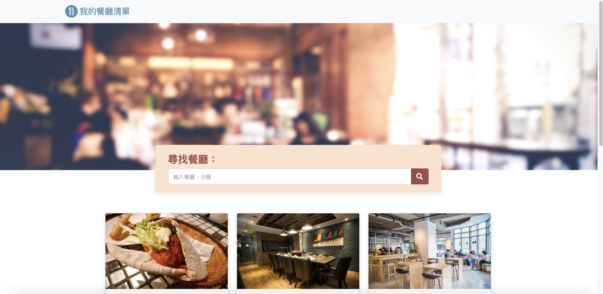
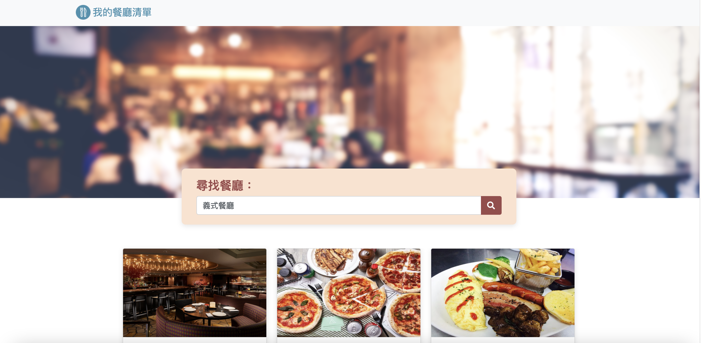

# Restaurant List
It's a restaurant list for users to search some good taste.

## Feature
- Users could find 8 default restaurant.
- Clicking the restaurant will show users information of the restaurant.
- Users could try to search any restaurants' name or category in the search bar.

### ScreenShots
- Main page

- Show page

- Search

- Not found results


### Prerequisites
1. Node.js
2. nodemon

### Install
1. Open your terminal and use git to clone this project
```git clone https://github.com/Beginneraboutlife116/restaurant_list.git```
2. Enter the restaurant_list files
```cd restaurant_list```
3. Install npm
```npm install```
4. Install nodemon
```npm install -g nodemon```
5. Use nodemon to start
```nodemon app.js```
6. You will see `This website is on "http://localhost:3000"` on the terminal.
Now, you could use http:localhost:3000 to see the restaurant list!!:tada::tada::tada: